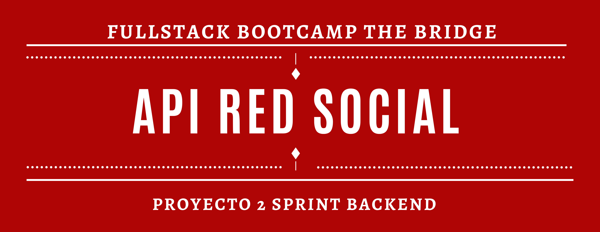

# Social Network API

This backend project demonstrates a RESTful API built using **Node.js**, **Express**, and **MongoDB/Mongoose**, focused on simulating a simple social media application.

---

## Objectives

- Register and authenticate users using **bcrypt** and **JWT**.
- Implement a fully functional **CRUD** system.
- Enable users to **like** and **unlike** posts and comments.
- Deploy the backend to a production environment.

## 🛠️ Tech Stack

<p align="center">      </p>

## Features

### Authentication & Security

<p align="center">   </p>

- User registration with password hashing.
- Login system that returns a JWT upon successful authentication.
- Middleware to protect routes and verify token.
- Email verification required before login.

### Endpoints

- Create, read, update and delete:
  - **Users**
  - **Posts**
  - **Comments**
- Ability to like and unlike comments.
- Upload images via **Multer** for:
  - Posts
  - Comments
  - User profiles
- Follower system

## Requirements

- **MongoDB Atlas** (or local MongoDB).
- Create `.env` and `docker-compose.yml` with the example files provided.

## 🚀 Getting started

1. Clone the repository:

```bash
git clone https://github.com/PaulaVegas/Proyecto_RedSocial.git
```

2. Install dependencies:

```bash
npm install
```

3. Run the project:

```bash
npm start
```

## API Documentation


This project includes interactive API documentation powered by Swagger UI, allowing you to explore all available endpoints directly from your browser.

### Access

With the API running, visit

```bash
http://localhost:3000/api-docs
```

## Credits

- Paula [@PaulaVegas](https://www.github.com/PaulaVegas)
